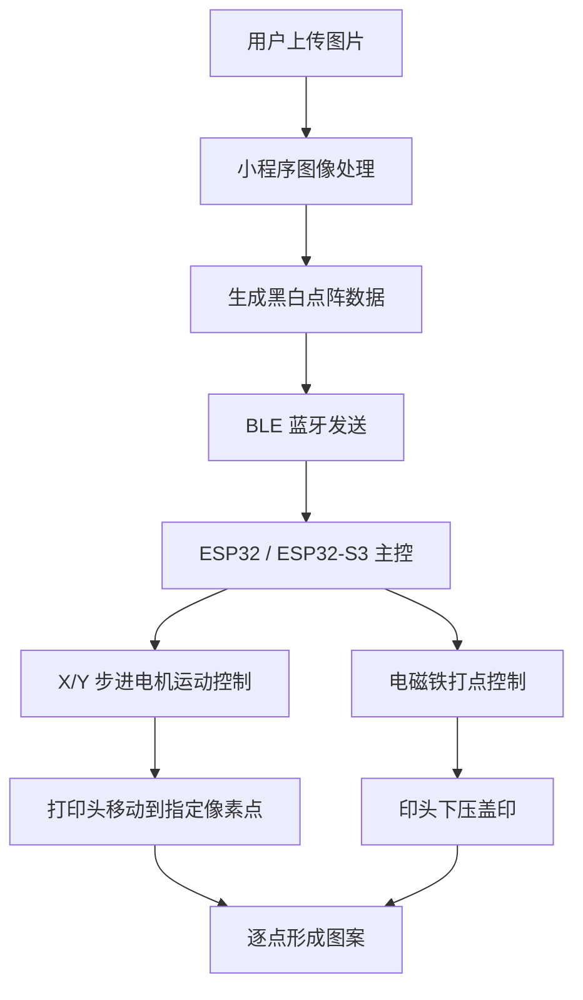

# Auto Dot-Matrix Stamp

基于图像像素化处理、XY 平面运动控制、BLE 蓝牙通信和电磁铁打点机构的自动点阵印章设备。

本项目是一款低成本、小型化的桌面级自动印章设备。用户通过微信小程序上传图片，小程序将图片处理为黑白像素点阵图，并通过蓝牙发送给硬件端。硬件端基于 ESP32 / ESP32-S3 接收点阵数据，控制 X/Y 步进电机移动打印头，并通过 24V 电磁铁驱动微型海绵 / 毛毡印头逐点下压，最终在纸面上形成像素化图案。

---

## 1. 项目简介

Auto Dot-Matrix Stamp 可以理解为一款小型化、低成本的“点阵式自动盖章设备”。

用户上传图片后，系统会将图片转换为黑白像素风图案，再由硬件设备按照像素点逐点盖印，最终在纸面上形成图案。

适用场景包括：

- 个性化图案印制
- 手账与文创装饰
- 桌面级创意硬件
- STEAM / 创客教学
- 图像处理与运动控制演示
- 自动化打点机构验证

---

## 2. 系统流程

```text
用户上传图片
    ↓
小程序进行图像处理
    ↓
生成黑白像素点阵图
    ↓
通过蓝牙发送点阵数据
    ↓
ESP32 接收并解析数据
    ↓
控制 X/Y 步进电机移动打印头
    ↓
控制电磁铁下压印头
    ↓
逐点完成图案印制
```

---

## 3. 系统组成

系统主要由两部分组成：

1. 软件端：微信小程序 / 手机小程序
2. 硬件端：自动印章设备



---

## 4. 软件端功能

软件端采用微信小程序或手机小程序形式，主要负责用户交互、图像处理和蓝牙通信。

| 功能模块 | 说明 |
|---|---|
| 图片上传 | 用户从相册选择图片或拍照上传 |
| 图片裁剪 | 将图片裁剪为适合打印的正方形区域 |
| 图像缩放 | 将图片缩放为固定分辨率，例如 40 × 40 像素 |
| 灰度处理 | 将彩色图片转换为灰度图 |
| 二值化处理 | 将灰度图转换为黑白点阵图 |
| 像素风预览 | 用户可以预览最终印章效果 |
| 参数设置 | 设置打印尺寸、像素密度、二值化阈值等参数 |
| 蓝牙连接 | 搜索并连接自动印章设备 |
| 数据发送 | 将点阵数据发送给 ESP32 |
| 打印控制 | 开始、暂停、停止打印任务 |

---

## 5. 图像处理流程

小程序端将用户上传的图片转换为黑白点阵数据。

```text
原始图片
  ↓
裁剪为正方形
  ↓
缩放为指定像素矩阵
  ↓
转灰度
  ↓
黑白二值化
  ↓
生成 0 / 1 点阵数据
```

其中：

- `0` 表示不盖印
- `1` 表示盖印

示例点阵：

```text
0000000000
0011111100
0100000010
0101111010
0101001010
0101111010
0100000010
0011111100
0000000000
```

---

## 6. 蓝牙通信协议

通信方式：小程序一次性发送完整点阵数据，ESP32 本地执行完整打印任务。

### 示例数据格式

```text
START
W:40
H:40
D:2
T:60
DATA:
010010001101...
END
```

### 字段说明

| 字段 | 含义 |
|---|---|
| START | 数据开始标志 |
| W | 图像宽度，单位为像素 |
| H | 图像高度，单位为像素 |
| D | 像素间距，单位为 mm |
| T | 电磁铁下压时间，单位为 ms |
| DATA | 黑白点阵数据 |
| END | 数据结束标志 |

### ESP32 解析逻辑

ESP32 端推荐按照以下方式处理：

1. 等待 `START`
2. 读取 `W`、`H`、`D`、`T` 等参数
3. 读取 `DATA` 后的点阵数据
4. 校验数据长度是否等于 `W × H`
5. 等待 `END`
6. 将任务保存到本地缓存
7. 执行回零和打印流程

---

## 8. 硬件系统

硬件端由主控模块、运动控制模块、电磁铁打点模块、电源模块和机械结构组成。

---

### 8.1 主控模块

```text
ESP32-S3
```

主控职责：

- 接收小程序蓝牙数据
- 解析黑白点阵矩阵
- 控制 X/Y 步进电机移动
- 控制电磁铁通断
- 读取限位开关状态
- 执行回零、打印、暂停、停止等任务

---

### 8.2 XY 运动控制模块

运动部分采用 XY 平面滑轨结构：

```text
X 轴：控制打印头左右移动
Y 轴：控制横梁前后移动
Z 轴：由电磁铁完成上下打点
```

运动控制逻辑：

```text
ESP32 输出 STEP / DIR 信号
    ↓
步进电机驱动器控制电机转动
    ↓
同步带带动滑块移动
    ↓
打印头到达指定像素位置
```

---

### 8.3 电磁铁打点模块

打印头部分安装在 X/Y 滑台上，由 24V 推拉式电磁铁控制印头上下运动。

结构：

```text
24V 推拉式电磁铁
    ↓
推杆
    ↓
印头安装座
    ↓
1.2 mm ～ 1.6 mm 海绵 / 毛毡印头
    ↓
纸面
```

工作过程：

```text
电磁铁通电
    ↓
推杆下压
    ↓
印头接触纸面并留下墨点
    ↓
电磁铁断电
    ↓
自带弹簧复位
    ↓
印头抬起
```

---

### 8.4 电磁铁驱动电路

通过 MOSFET 控制电磁铁。

基本结构：

```text
ESP32 GPIO
    ↓
N 沟道 MOSFET
    ↓
24V 电磁铁
```

电路需要包括：

| 器件 | 作用 |
|---|---|
| N 沟道 MOSFET | 控制电磁铁通断 |
| 续流二极管 | 吸收电磁铁断电时产生的反向电压 |
| Gate 电阻 | 保护 GPIO，减少振荡 |
| 下拉电阻 | 防止上电误触发 |
| 24V 电源 | 给电磁铁供电 |

---

### 8.5 电源系统

使用 24V 主电源。

电源结构：

```text
24V 电源
  ├── 给步进电机驱动器供电
  ├── 给 24V 电磁铁供电
  └── 通过降压模块转换为 5V
          ↓
        ESP32 供电
```

注意：

> ESP32、电机驱动器、电磁铁驱动电路必须共地。

否则控制信号可能不稳定。

---

## 9. 打印工作流程

完整打印流程如下：

1. 用户打开小程序
2. 上传图片
3. 小程序将图片处理为黑白像素风图像
4. 用户预览效果并确认
5. 小程序通过蓝牙连接自动印章
6. 小程序发送点阵数据
7. ESP32 接收并校验数据
8. X/Y 滑轨自动回零
9. 打印头移动到起始位置
10. 按照点阵矩阵逐行扫描
11. 遇到黑色像素点，电磁铁下压盖印
12. 遇到白色像素点，跳过
13. 打印完成后滑轨回到安全位置

PS：采用蛇形扫描路径：减少空行程，提高打印效率。

---

## 10. 仓库结构

```text
auto-dot-matrix-stamp/
├── README.md
├── LICENSE
├── .gitignore
│
├── firmware/
│   ├── esp32_stamp_controller/
│   │   ├── src/
│   │   ├── include/
│   │   ├── lib/
│   │   ├── platformio.ini
│   │   └── README.md
│   │
│   └── test_firmware/
│       ├── motor_test/
│       ├── solenoid_test/
│       ├── limit_switch_test/
│       └── ble_test/
│
├── mini-program/
│   ├── pages/
│   ├── components/
│   ├── utils/
│   ├── app.js
│   ├── app.json
│   └── README.md
│
├── hardware/
│   ├── wiring/
│   ├── pcb/
│   ├── mechanical/
│   ├── bom/
│   └── README.md
│
├── docs/
│   ├── product-definition.md
│   ├── system-architecture.md
│   ├── ble-protocol.md
│   ├── motion-control.md
│   ├── solenoid-module.md
│   └── testing-plan.md
│
├── tools/
│   ├── image_matrix_generator/
│   ├── path_simulator/
│   └── protocol_debugger/
│
└── assets/
    ├── images/
    ├── diagrams/
    └── demo/
```

---

## 11. 开发路线

### Phase 1：基础硬件测试

- [ ] 测试 ESP32 GPIO 输出
- [ ] 测试 X 轴步进电机
- [ ] 测试 Y 轴步进电机
- [ ] 测试限位开关
- [ ] 测试 MOSFET 电磁铁驱动
- [ ] 测试 24V 电源和 5V 降压模块
- [ ] 检查所有模块是否共地

### Phase 2：基础运动控制

- [ ] 实现 STEP / DIR 电机控制
- [ ] 实现 X/Y 轴回零
- [ ] 实现 mm 到 step 的换算
- [ ] 实现单点移动
- [ ] 实现 XY 坐标移动
- [ ] 实现蛇形扫描路径

### Phase 3：电磁铁打点控制

- [ ] 测试单次下压时间
- [ ] 测试印头复位速度
- [ ] 测试墨点大小
- [ ] 测试连续打点稳定性
- [ ] 评估电磁铁发热情况

### Phase 4：BLE 蓝牙通信

- [ ] 实现 BLE 广播
- [ ] 实现小程序蓝牙连接
- [ ] 实现数据包发送
- [ ] 实现打印任务解析
- [ ] 实现数据校验机制

### Phase 5：小程序图像处理

- [ ] 图片上传
- [ ] 正方形裁剪
- [ ] 图像缩放
- [ ] 灰度转换
- [ ] 二值化处理
- [ ] 像素风预览
- [ ] 打印参数设置
- [ ] BLE 数据发送

### Phase 6：整机联调

- [ ] 打印 5 × 5 测试点阵
- [ ] 打印 10 × 10 测试点阵
- [ ] 打印 20 × 20 测试点阵
- [ ] 打印 40 × 40 MVP 点阵
- [ ] 优化打印速度
- [ ] 优化墨点清晰度
- [ ] 优化电磁铁下压力和下压时间

---

